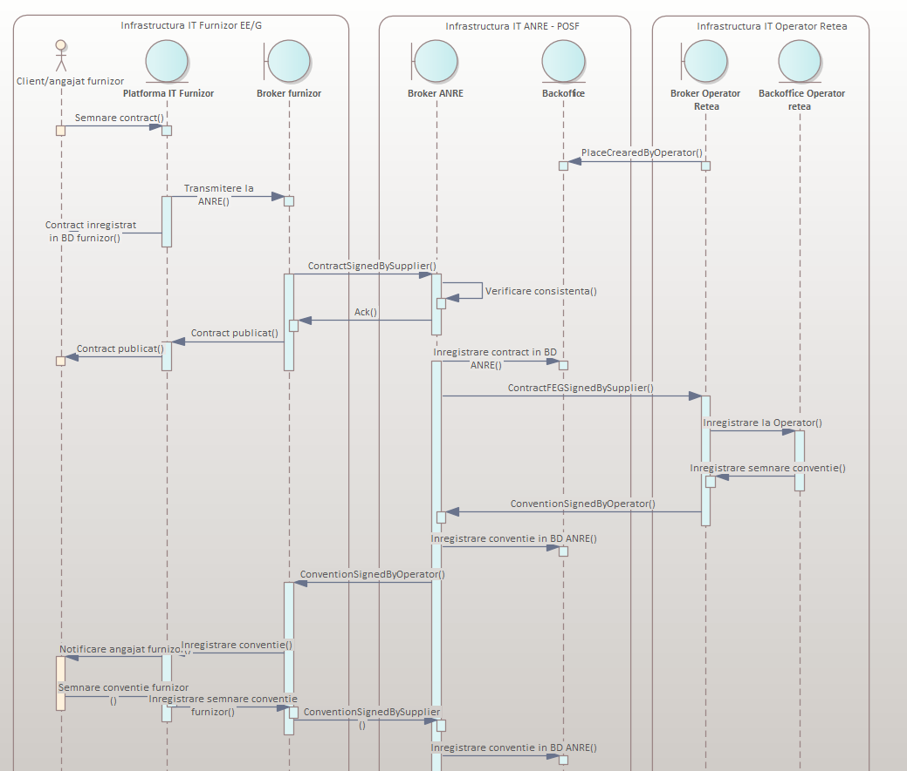
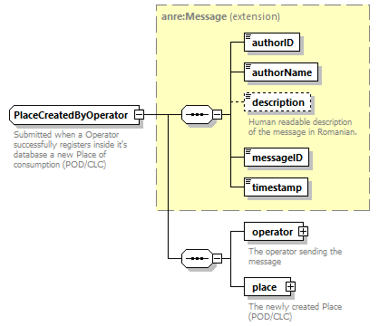
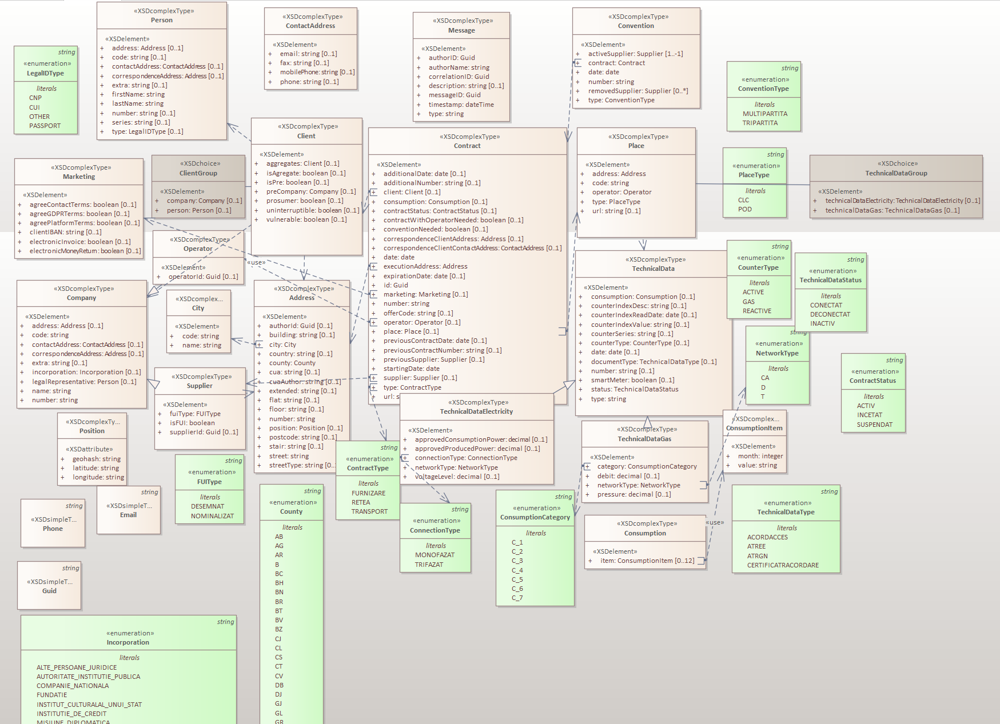
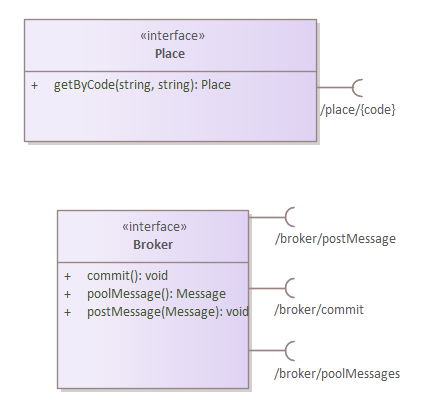
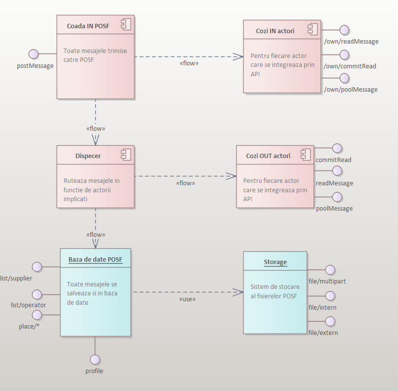
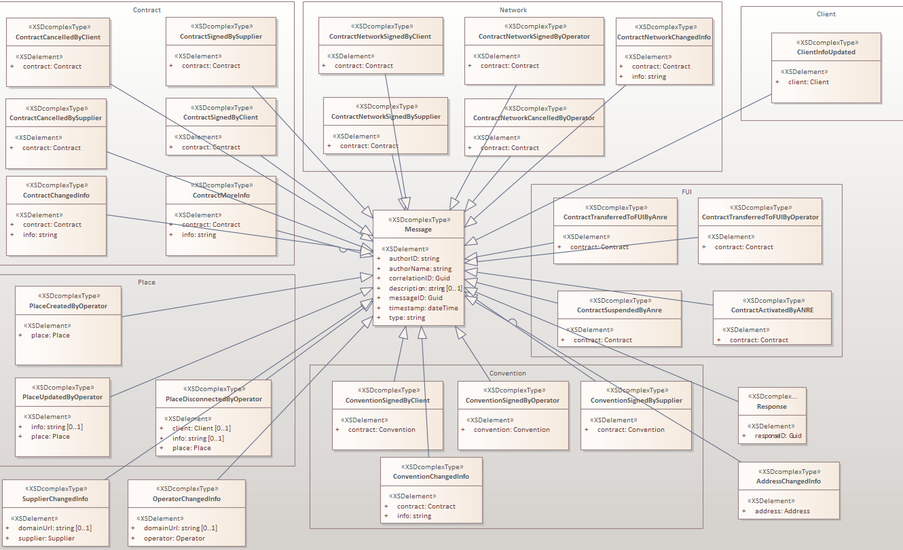
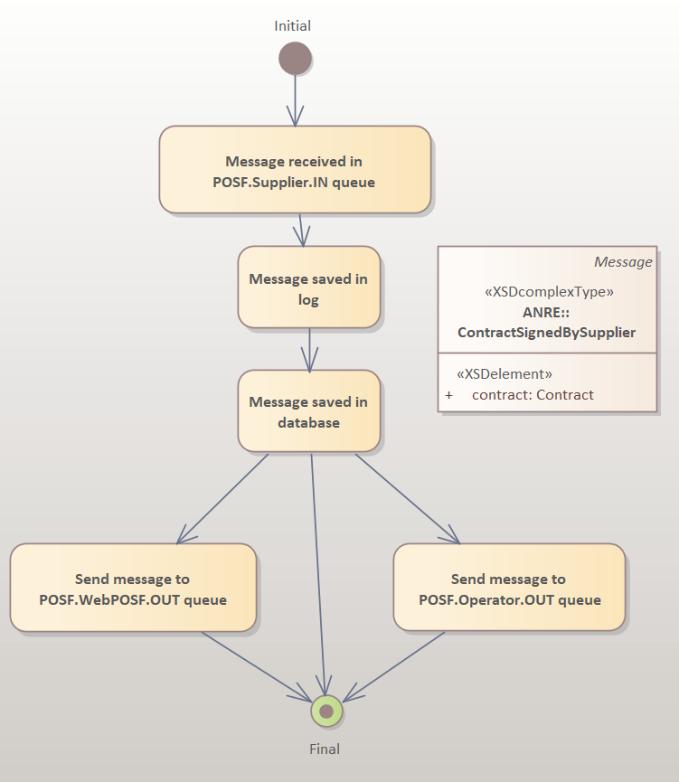
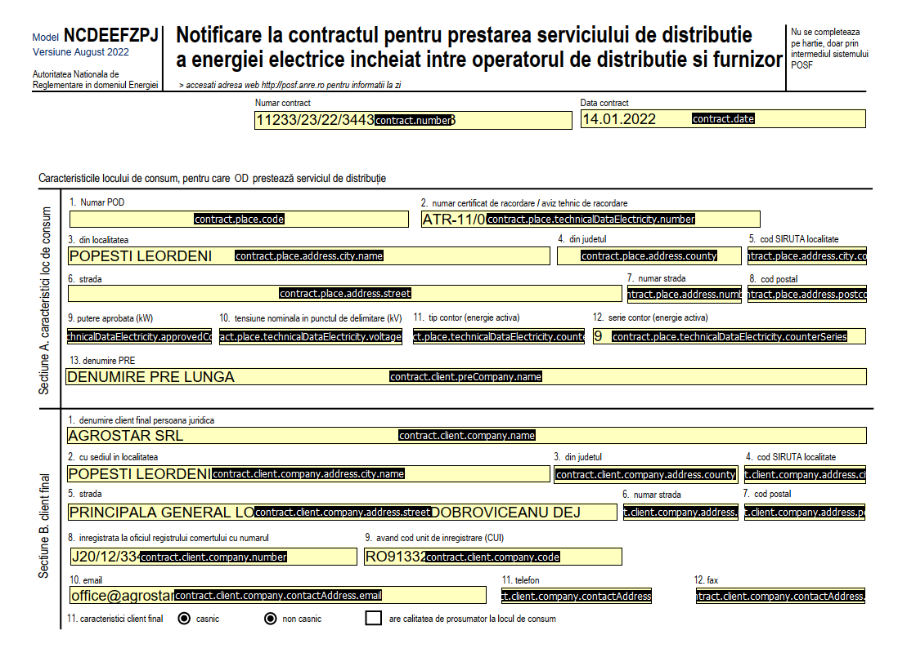

# Propunere de lucru pentru specificatia tehnica de interconectare a sistemului POSF cu furnizorii si operatorii

Documentatia detaliata a tuturor tipurilor de elemente o puteti descarca in format PDF de aici [Schema PDF](./ANRESchema.pdf)

Schema de ansamblu prezentata in cadrul sedintei tehnice o regasim mai jos.  Mentionez ca aceasta schema este cu titlu de concept de schimb de mesaje, fluxurile desenate ne fiind cele finale care vor fi implementate conform regulamentului.



.


In fisierul [ANRESchema.xsd](ANRESchema.xsd) este definitia schemei entitatilor si mesajelor propuse, primul mesaj care are o schema aproape completa este ilustrat in imagidea nde mai jos. 
```
PlaceCreatedByOperator
```


Tipurile de elemente definite in fisierul XSD va fi folosit pentru comunicarea prin mesaje in format XML sau JSON cu sistemul POSF. Prezentam o diagrama a acestor tipuri.

 

# Tipuri de cozi de mesaje in POSF

Pentru fiecare actor care interactioneaza cu API POSF se vor crea 2 cozi de mesaje prin care se va comunica, cozi de mesaje gestionate in tehnologia Kafka.


- POSF.Operator1.IN - este o coada de mesaje unde scrie Operator1 iar POSF  citeste
- POSF.Operator1.OUT - este o coada de mesaje unde scrie POSF iar Operator1 citeste

Unde Operator1 este codul individualizat al fiecarui actor de tip furnizor sau operator.

Cozile de mesaje sunt accesate folosind un API de interogare (post/pool) pentru care exista un sample care poate fi instalat local [aici SAMPLE API](samples/python/). Metoda push va scrie in coada .IN iar metoda pool va citi din coada .OUT. Recomandam instalarea locala a sample-ului si exersarea metodelor pentru a transmite feedback cu privire la necesitatile tehnologice identificare.

 

Sistemul POSF va fi responsabil cu rutarea mesajelor intre cozile de mesaje ale furnizorilor, operatorilor precum si interfata Web pusa la dispozitie clientilor. Schema componentelor este prezentata mai jos

 

## Lista API in format SWAGGER

Lista tuturor metodelor ce pot fi apelate prin API o gasiti aici (https://posf-staging.anre.ro/broker/swagger-ui/index.html#/)

Principalele metode sunt:
1. /poolMessage - cere ultimul mesaj primit si trece la urmatorul
2. /postMessage - trimite un mesaj
3. /readMessage - citeste ultimul mesaj primit
4. /commitRead - trece la urmatorul mesaj primit
5. /profile - intoarce informatii despre contul curent
6. /list/supplier - lista de furnizori (cu UUID-urile 
acestora)
7. /list/operator - lista de operatori (cu UUID-urile 
acestora)
8. /list/{id} - detaliile unui furnizor sau operator
9. /place/{county}/{siruta}/{type}/{code}  -detaliile unui loc de consum (actualizat de operator prin mesajele Place*) 
10. /place/{type}/{code} - lista cu locurile de consum de tipul precizat care au codul respectiv
10. /file/ acces la fisierele atasate mesajelor
11. /total intoarce numarul total de mesaje trimise in POSF, grupate pe tip
12. /broker/poolBatch - citeste o lista de mesaje 
13. /broker/readBatch - citeste ultimele N mesaje
14. /broker/commitReadBatch - trece la urmatoarele N mesaje. ATENTIE!!! daca readBatch intoarce doar N-2 mesaje trebuie sa trimiteti aceeasi valoare la commitBatch, adica N-2. Altfel riscati sa pierdeti mesaje. Gasiti in tipul Batch numarul de mesaje continute pe campul "count"
15. /own/poolMessage,readMessage,commitMessage citesc mesajele publicate de autor
16. /borker/refused/paged de tip POST cu parametri ex: {"page":0, pageSize:10} intoarce mesajele incarcate care nu pot fi interpretate de aplicatia WebPOSF.
17. /borker/allow_contract de tip POST cu parametri ex: {"code":"1234567890123", "place_type":"CLC", "place_code":"123321233", "starting_date":"dataschimbarii"} are ca rezultat HTTP200 cu {"result":"allow"} daca respectiva persoana fizica/juridica (identificata prin CNP/CUI) poate initia proces de schimbare furnizor prin POSF incepand cu data comunicata. Discutii pe issue aici https://github.com/posfgit/standard/issues/197. Sistemul returneaza valorile astfel {"result":"allow/deny"} cu HTTP200 in cazul in care locul de consum exista. 


- toate cererile de citit mesaje au un parametru suplimentar "batchSize" de tip intreg, limitat la 100, daca e nevoie mai marim.
- returneaza tipul Batch care include unul sau mai multe mesaje conform schemei XSD de pe GIT
## Exemplu in Java

Gasiti [aici un exemplu](samples/java/)  de conectare la API POSF prin intermediul limbajului de programare Java. In cod veti vedea cum se introduce user/parola, se obtine un token de acces si apoi se inteogheaza lista furnizorilor. 

# Mesajele vehiculate in sistem

Toate mesajele au o structura comuna derivata din tipul **Message** care reprezinta un header comun compus din urmatoarele campuri

Cateva exemple de mesaje sunt disponibila in folderul [XML](xml/)

|Camp|Explicatie|
|:--|:--|
|authorID|ID asignat de POSF pentru sistemul IT care emite mesajul|
|authorName|Nume de cod asignat de POSF pentru sistemul IT care emite mesajul|
|correlationID|ID unic (guid) atribuit de cel care initiaza sesiunea de comunicare cu POSF, folosit ulterior de cei care raspund la mesaje din cadrul aceleiasi discutii virtuale. De exemplu cand se publica un contract semnat de client, pentru o usoara urmarire a tranzactiei pe termen lung, se va genere un ID unic care va fi utilizat in raspunsul din partea sistemelor furnizorului sau operatorului. Un ID de corelare, cunoscut și sub numele de ID de tranzit, este o valoare de identificare unică care este atașată solicitărilor și mesajelor care permit referirea la o anumită tranzacție sau lanț de evenimente.|
|description|Descriere in text liber al mesajului|
|messageID|identificator unic al mesajului in format GUID|
|timestamp|data ora minut secunda la care a fost emis creat mesajul|
|type|Tipul mesajului, va fi identic cu numele tag-ului Root al mesajului XML: ContractSignedByClient, PlaceCreatedByOperator, etc.|


# Tipuri de mesaje, emitatori si receptori

Diagrama de mai jos prezinta tipurile de mesaje care pot fi trimise/receptionate prin POSF. Detaliem pentru detaliem fiecare clasa de mesaje in tebele mai jos.



## Mesaje pe tema locuri de consum

| Denumire mesaj | Scop | Sursa | Redirectionat la | Observatii |
|:--|:------|:--|:--|:--|
|PlaceCreatedByOperator|Instiintare trimisa catre POSF despre crearea unui nou loc de consum|Operatorul|Nimeni|Art 25, literia i |
|PlaceUpdatedByOperator|Instiintare trimisa catre POSF despre actualizare loc de consum|Operatorul|Nimeni|Art 25, literia j |
|PlaceDisconnectedByOperator|Instiintare trimisa catre POSF despre deconectare loc de consum|Operatorul|Nimeni|Art 25, literia j |

## Mesaje pe tema contracte de furnizare

| Denumire mesaj | Scop                                                                                                                                                                                                                                                                                                                                                                                                                                                                                                                                                                     | Sursa |  Redirectionat la | Observatii |
|:-|:-------------------------------------------------------------------------------------------------------------------------------------------------------------------------------------------------------------------------------------------------------------------------------------------------------------------------------------------------------------------------------------------------------------------------------------------------------------------------------------------------------------------------------------------------------------------------|:-|:-|:-|
|ContractSignedBySupplier| Instiintare despre contract semnat de furnizor, dupa ce a semnat in prealabil si clientul fie la ghiseu fie prin aplicatia furnizorului. Se emite si cand furnizorul deruleaza procesul de semnare in afara platformei POSF, doar cand contractul a fost semnat semnat de ambele parti.                                                                                                                                                                                                                                                                                  | Furnizor,WebPOSF | Operator, WebPOSF, Furnizor vechi|Art 27, litera g |
|ContractSignedByClient| Instiintare despre contract semnat de client in aplicatia WebPOSF                                                                                                                                                                                                                                                                                                                                                                                                                                                                                                        | WebPOSF | Furnizor nou| |
|ContractCancelledByClient| Se emite din aplicatia WebPOSF cand un utilizator s-a razgandit in timp ce trimisese deja semnat la furnizor un contract sau daca vrea sa renunte la un contract existent.                                                                                                                                                                                                                                                                                                                                                                                               | WebPOSF | Furnizor nou, furnizor vechi, Operator| |
|ContractCancelledBySupplier| Se emite din aplicatia WebPOSF sau sistemul furnizorului cand un furnizor s-a razgandit pe un contract semnat sau vrea sa anuleze un contract existent. Mesajul se emite doar in ziua in care se inceteaza contractul, nu in avans, atat in WebPOSF cat si in sistemul furnizorului. Pentru anuntarea in avans a incetarii se trimite NotificationPublishedBySupplier completand campul dueDate, cu mentiunea ca aceasta notificare nu produce niciun efect in webPOSF                                                                                                   | Furnizor, WebPOSF | Furnizor vechi, Operator, WebPOSF| |
|ContractMoreInfo| Trimis de furnizor care solicita mai multe informatii de la cealalta parte.                                                                                                                                                                                                                                                                                                                                                                                                                                                                                              | Furnizor, WebPOSF modul furnizor | WebPOSF modul client| |
|ContractChangedInfo| Emis de catre Furnizor la momentul actualizarii informariilor care nu au impact in fluxurile informatice:<br/>Prin webPOSF se pot realiza urmatoarele:<br/>- prelungire valabilitate contract de furnizare;<br/>- transmitere al doilea index (la momentul intrarii contractului de furnizare in efectivitate). <br/>Prin broker se pot realiza urmatoarele:<br/>- prelungire valabilitate contract de furnizare;<br/>- transmitere al doilea index (la momentul intrarii contractului de furnizare in efectivitate);<br/>- modificare nume/denumire titular de contract de furnizare, cu pastrare CNP/CUI. |Furnizor, WebPOSF modul furnizor|Toti cei mentionati in contract| Nu este necesar sa se raspunda la acest mesaj|

## Mesaje pe tema contracte de retea

| Denumire mesaj | Scop | Sursa  | Redirectionat la | Observatii |
|:-|:---------|:-|:-|:-|
|~~ContractNetworkSignedByClient~~|~~Emis din WebPOSF cand se semneaza contractul de retea de catre Client~~|~~WebPOSF, Operator~~|~~WebPOSF, Furnizor~~|Nu se foloseste in aceasta versiune de standard |
|ContractNetworkSignedByOperator|Emis din WebPOSF/platforma Operator cand se semneaza contractul de retea de catre Operator. Pentru tipul de contract TRANSPORT doar operatorul emite, ceilalti doar iau nota de mesaj.|Operator|WebPOSF, Furnizor| |
|ContractNetworkSignedBySupplier|Emis de Furnizor din sistemul propriu sau WebPOSF cand se semneaza contractul de retea de catre Furnizor|WebPOSF, Supplier| WebPOSF , Operator , Furnizor vechi| |
|ContractNetworkCancelledByOperator|Emis din WebPOSF/platforma Operator cand se doreste anularea contractului de retea cu clientul sau cu Furnizorul|WebPOSF, Operator|WebPOSF, Operator, Supplier| |
|ContractNetworkChangedInfo|Emis doar de Operatorul de retea la momentul actualizarii de informatii pe locul de consum. De exemplu cand intre Operator si Furnizor exista deja un contract de retea, adaugarea unui loc de consum in cadrul contractului respectiv se va face prin emiterea de catre operator a acestui mesaj completand supplier si previousSupplier. De asemenea in momentul cand se incheie contract de retea intre OR si CF[A se vedea discutia din sedinta Zoom la minutul 53 ](https://drive.google.com/file/d/1zwfiNh8W6Sx9lFidysxUSF-U4tzfV5ox/view?usp=sharing).|Operator sau WebPOSF modul operator |Toti cei mentionati in contractul de retea (CF daca are contract direct, FA, FN)| |

## Mesaje pe tema FUI

| Denumire mesaj | Scop | Sursa |  Redirectionat la | Observatii |
|:-|:---------|:-|:-|:-|
|ContractSuspendedByAnre|Emis de WebPOSF cand un key user al ANRE introduce faptul ca unui furnizor i s-a suspendat licenta|WebPOSF|WebPOSF, Furnizor, Operator| |
|ContractActivatedByANRE|Emis de WebPOSF cand un key user al ANRE introduce faptul ca unui furnizor i s-a activat licenta|WebPOSF|WebPOSF, Furnizor, Operator| |
|ContractTransferredToFUIByOperator|Emis de WebPOSF / platforma operator cand un angajat al operatorului introduce faptul ca un furnizor se afla in imposibilitate de furnizare sau in cazul in care toate CF de pe locul de consum au expirat|WebPOSF, Operator|WebPOSF, Furnizor, Operator|Sunt aceleasi informatii ca in cazul ContractSignedByClient, cu mentiunea ca furnizorul nu mai emite mesajul de semnare contract |
|ContractTransferredToFUIByAnre|Emis de WebPOSF cand un key user ANRE introduce in sistemul WebPOSF faptul ca un contract se transfera la FUI|WebPOSF|WebPOSF, Furnizor, Operator| Operatorul va emite ContractNetworkChangedInfo|

## Mesaje pe tema conventiilor

| Denumire mesaj | Scop | Sursa |  Redirectionat la | Observatii |
|:-|:---------|:-|:-|:-|
|ConventionGeneratedByPOSF|Emis automat de POSF cand se creaza o conventie sau apar noi parti intr-o conventie |POSF|WebPOSF, Furnizor, Operator| Se trimite automat de POSF catre toate partile|
|ConventionSignedByOperator|Emis de WebPOSF/platforma operatorului cand a operatorul a semnat conventia cu un client si un nou furnizor |WebPOSF, Operator|WebPOSF, Furnizor, Operator| Chiar daca nu este emis acest mesaj, se considera ca in 24 de ore conventia produce efecte conform regulament|
|~~ConventionSignedByClient~~|~~Emis de WebPOSF cand a semnat clientul conventia~~|~~WebPOSF~~|~~WebPOSF, Furnizor, Operator~~| Nu este folosit in aceasta versiune de standard, consideram ca mesajul de semnare contract contine deja toate informatiile si pentru conventie|
|ConventionSignedBySupplier|Emis de Furnizor cand a semnat conventia|WebPOSF modul furnizor, Furnizor|WebPOSF modul, Furnizor, Operator| Reprezinta o confirmare ca furnizorul si-a insusit apartanenta la conventie, dar in lipsa emiterii acestui mesaj furnizorul nu este absolvit de responsabilitati. Chiar daca nu o face, se considera ca in 24 de ore conventia produce efecte conform regulament|
|~~ConventionChangedInfo~~|~~Emis de oricare din partile conventiei la momentul actualizarii de informatii care nu au impact in fluxurile informatice~~|~~Oricine este prezent in conventie~~|~~Toti cei mentionati in conventie~~| Nu mai este cazul, conventia semnata de operator este suficienta, nu vor aparea schimbari utile partilor pe acest document, vor avea aceleasi informatii actualizate din contractele de furnizare sau de retea.|

## Mesaje specifice furnizorilor/operatorilor

| Denumire mesaj | Scop | Sursa |  Redirectionat la | Observatii |
|:-|:---------|:-|:-|:-|
|SupplierChangedInfo|Emis de WebPOSF/platforma furnizorului cand s-au schimbat date de identificare/persoane/adresa|WebPOSF, Furnizor|WebPOSF,  toti operatorii, toti furnizorii| |
|OperatorChangedInfo|Emis de platforma operatorului cand s-au schimbat date de identificare/persoane/adresa|Operator|WebPOSF,  toti operatorii, toti furnizorii| |


## Mesaje de tip notificare intre partile unui contract

Introducem o categorie noua de mesaje numite notificari pentru a fi folosite de actorii din piata in cadrul contractelor incarcate in POSF.

| Denumire mesaj | Scop | Sursa |  Redirectionat la | Observatii |
|:-|:---------|:-|:-|:-|
|NotificationDeadlineReached|Emis automat de sistemul POSF in ziua imediat urmatoare (00:00+1) pentru toate contractele ajunse la terment in ziua anterioara. |POSF|Toate partile din contract| Operatorul de retea dupa caz va trimite un mesaj in cadrul POSF pentru trecere la FUI sau deconectare (ContractTransferredToFUIByOperator sau PlaceDisconnectedByOperator|
|NotificationDeadlineDue|Emis automat de sistemul POSF cu 7 zile anterior ajungerii la termen ale unui contract activ|POSF | Toate partile din contract| Daca mesajul nu este urmat de un mesaj specific de contract, acesta nu produce nici un efect in cadrul relatiilor contractuale |
|NotificationPublishedBySupplier|Emis de furnizor prin WebPOSF sau sistemul propriu pentru a notifica partile dintr-un contract despre potentiala activare a unei clauze contractuale la o data limita. | WebPOSF sau Furnizor|Toate partile din contract| |
|NotificationPublishedByOperator|Emis de operator prin WebPOSF sau sistemul propriu pentru a notifica partile dintr-un contract despre potentiala activare a unei clauze contractuale la o data limita. | WebPOSF sau Operator|Toate partile din contract| |

Notificarile emise de POSF, nu sunt considerate elemente obligatorii în sistemul POSF. Aceste notificări au rol de informare. Cu alte cuvinte, dacă aceste notificări nu sunt urmate de un mesaj ferm de tip Contract*, atunci ele nu vor declansa in POSF nicio actiune.

Indiferent dacă se primesc sau nu NotificationDeadlineReached sau NotificationDeadlineDue, OR are obligatia să ia în considerare data de expirare (expirationDate) din mesajele ContractSignedBySupplier, ContractChangedInfo, ContractTransferredToFUIByOperator și ContractTransferredToFUIByAnre și să acționeze în POSF conform regulamentului. Aceste mesaje sunt esențiale pentru a se asigura de faptul că au informațiile necesare despre contracte și termenele limită asociate acestora.

Notificarile care se trimit in avans detin un camp numit "dueDate" prin care se va specifica data de la care va intra in efectivitate respectiva modificare de contract.

Notificarile care presupun un motiv anume vor contine si un camp denumit "reason" de tip nomanclator prin care se poate transmite intre parti motivul notificarii. In schema XSD gasiti tipurile de motive acceptate de sistem.

Deschidem un issue de discutii pe tema notificarilor aici:
https://github.com/posfgit/standard/issues/184

## Detalii privind schimbarea de furnizor 

Precizam faptul ca mentiunile de mai jos nu se aplica pentru contractele noi, ci doar pentru schimbarea de furnizor.

*Gaze Naturale - CF - Persoane Juridice*
- trimiterea unui mesaj de tip ContractSignedBySupplier, pentru orice contract care este pe acelasi loc de consum (acelasi place_id), este diferit de contractul curent si nu este INCETAT sau SUSPENDAT, va schimba statusul in ACTIV_IN_CURS_DE_SCHIMBARE.

*Gaze Naturale - CF - Persoane Fizice*
- trimiterea unui mesaj de tip ContractSignedBySupplier, pentru orice contract care este pe acelasi loc de consum (acelasi place_id), este diferit de contractul curent si nu este INCETAT sau SUSPENDAT, va schimba statusul in ACTIV_IN_CURS_DE_SCHIMBARE.

*Energie Electrica - CF - Persoane Fizice*
- trimiterea unui mesaj de tip ContractSignedBySupplier, pentru orice contract care este incheiat cu o persoana fizica, este diferit de contractul curent, este pe acelasi loc de consum (acelasi place_id) si nu este INCETAT sau SUSPENDAT, va schimba statusul in ACTIV_IN_CURS_DE_SCHIMBARE.
- trimiterea unui mesaj de tip ContractSignedBySupplier nu închide contractul actual pentru persoane juridice, fiind necesar ca furnizorul actual (previousSupplier) sa trimita un ContractCancelledBySupplier pentru aceste situatii.

*Energie Electrica - CF - Persoane Juridice*
- trimiterea unui mesaj de tip ContractSignedBySupplier, pentru orice contract care este pe acelasi loc de consum (acelasi place_id), este diferit de contractul curent, nu este INCETAT sau SUSPENDAT si este incheiat cu acelasi furnizor sau cu acelasi furnizor precedent daca exista, va schimba statusul in ACTIV_IN_CURS_DE_SCHIMBARE.
- trimiterea unui mesaj de tip ContractSignedBySupplier nu închide contractul actual, daca furnizorul contractului actual este diferit de furnizorul nou sau furnizorul precedent, fiind necesar să trimiteți un ContractCancelledBySupplier pentru aceste situatii.

*Cazuri exceptionale - prin INIT*
- pentru toate situatiile mentionate mai sus privind statusul ACTIV_IN_CURS_DE_SCHIMBARE, daca se introduce ContractSignedBySupplier cu INIT (date retroactive), nu se va schimba statusul in ACTIV_IN_CURS_DE_SCHIMBARE, ci se va schimba statusul in INCETAT. 

## Motive de incetare contract 

Incepand cu data 13.03.2023 platforma POSF nu va mai primi mesaje ContractCancelledBySupplier daca nu are completat campul reason cu una din valorile de mai jos:

- ANULARE_CERERE_CONTRACTARE
- DENUNTARE
- DENUNTARE_INCETARE_LOC
- REZILIERE
- REZILIERE_NEPLATA
- ACORDUL_PARTILOR
- ACORDUL_PARTILOR_INCETARE_LOC
- EROARE_MATERIALA

Explicatii:

- ANULARE_CERERE_CONTRACTARE - folosit de Client/Furnizor in intervalul celor 14 zile
- DENUNTARE - Folosit doar la cererea clientului, fara ridicare contor
- DENUNTARE_INCETARE_LOC - Folosit la cererea clientului cand specifica ca nu doreste sa mai consume la locul respectiv, avand ca implicatie ridicarea contorului doar la gaze naturale
- REZILIERE - Folosit doar la cererea furnizorului, fara sa indice o problema de neplata
- REZILIERE_NEPLATA - Folosit doar la cererea furnizorului doar in caz de neplata
- ACORDUL_PARTILOR - Motiv de incetare contract cu acordul partilor
- ACORDUL_PARTILOR_INCETARE_LOC - Motiv de incetare contract cu acordul partilor, cand clientul specifica ca nu doreste sa mai consume la locul respectiv, avand ca implicatie ridicarea contorului doar la gaze naturale
- EROARE_MATERIALA - Folosit pentru a informa ca mesajul trimis anterior de semnare contract (doar mesajele CSBS) a fost introdus gresit. Pentru acest caz e nevoie ca previousSupplier sa publice in POSF CCI cu actualizarea datelor contractului existent astfel incat acesta sa intre din nou in vigoare. Fiind o eroare, autorul acestei erori e responsabil sa contacteze previous supplier si OD in afara POSF astfel incat sa se corecteze situatia contractuala si a consumului alocat.

Aceste motive au fost in consultare cu FZ si OD  aici:
https://github.com/posfgit/standard/issues/231

# Referitor la schimbarile administrative 

Schimbarile administrative (de ex. adresa sau denumire, fara schimbarea CUI/CNP-ului) se pot realiza in felul urmator:

Prin API:
- schimbarile de titular prin CSBS, iar alte schimbari administrative (de ex. adresa sau denumire, fara schimbarea CUI/CNP-ului) prin CCI.

Prin web POSF:
- pentru toate schimbarile administrative se trimite CSBS, iar al doilea index si prelungirea valabilitatii contractului se trimit cu CCI.


# Exemplu de flux pornind de la ContractSignedBySupplier

Dupa ce se emite mesajul ContractSignedBySupplier, avem urmatoarele mesaje:

1. Daca exista contract de retea intre CF si OR sau FN si OR, se emite ContractNetworkChangedInfo, adica se adauga locul de consum la contractul de retea existent
2. Daca nu exista contract de retea intre CF si OR sau FN si OR, iar CF vrea direct cu OR, se emit mesajele 
ContractNetworkSignedByClient si ContractNetworkSignedByOperator
3. Daca nu exista contract de retea intre CF si OR sau FN si OR, iar serviciul de retea se realizeaza prin FN, se emit mesajele ContractNetworkSignedBySupplier si ContractNetworkSignedByOperator


# Mesajul ContractNetworkSignedBySupplier

Diagrama de mai jos prezinta fluxul pe care mesajul ContractNetworkSignedBySupplier il parcurge in interiorul sistemului POSF, de la receptie in coada POSF.Supplier.IN pana cand este transmis in cozile de mesaje ale aplicatiei Web si ale operatorului respectiv.




# Precizari privind starea locurilor de consum:
- CONECTAT - locul de consum este conectat, poate avea contracte de furnizare active, se pot adauga contracte noi de furnizare sau se pot realiza schimbari de furnizor
- INACTIV - locul de consum nefinalizat, fara contor montat, se va trece in stare CONECTAT pentru a adauga contracte de furnizare
- DECONECTAT - locul de consum este deconectat, EE: nu mai sunt contracte de furnizare active, se pot adauga contracte noi de furnizare, GN: s-a deconectat pentru neplata, se pot realiza schimbari de furnizor
- DEZAFECTAT - locul de consum se poate trece in stare dezafectat doar daca nu mai sunt contracte active si nu se mai pot incheia contracte pe locul de consum in status dezafectat - Atentie! Urmeaza sa fie implementat pe mediul de productie.

# Inrolarea in sistem, migrarea datelor existente

Inrolarea unui nou operator/furnizor in sistem presupune optinerea datelor de conectare pentru persoana juridica (user/parola/identificator unic) urmata de introducerea in sistem a datelor pe care ecesta le detine, date care se afla sub incidenta regulamentului, cum ar fi: contracte, locuri de consum, etc.

Procedura de migrare date existente presupune transmiterea de mesaje pentru toate informatiile pe care furnizorul/operatorul le detine, unul cate unul, folosind cateva mesaje specifice care se presupune ca nu vor genera fluxuri informationale in sistemele tertilor.

De exemplu, se vor trimite toate locurile de consum existente ale unui operator care se inroleaza in sistem, prin intermediul mesajului PlaceUpdatedByOperator, unul cate unul. Pentru fiecare din aceste mesaje trimise, sistemul informatic al furnizorului/operatorului va memora identificatorul unic returnat de POSF ca dovada a transmisiei ("responseID"). 
Pentru a marca mesajele care provin din procesul de inrolare/migrare recomandam ca pe mesajele care incarca date existente in sistemul informatic, sa se foloseasca campul "info" din structura mesajului unde se va completa cu textul "INIT". 

Mesaje folosite pentru a incarca date in sistem, fara a presupune ca aceste mesaje declanseaza fluxuri in POSF sau in alte sisteme:

|Eveniment|Mesaj folosit|Observatii|
|:--|:--|:--|
|Incarcare contract existent|ContractChangedInfo|Se completeaza campul "info" cu textul "INIT"|
|Incarcare loc de consum existent|PlaceUpdatedByOperator|Se completeaza campul "info" cu textul "INIT"|
|Incarcare contract de retea existent|ContractNetworkChangedInfo|Se completeaza campul "info" cu textul "INIT"|
|Incarcare conventie existenta|ConventionChangedInfo|Se completeaza campul "info" cu textul "INIT"|

# Operationalizarea operatorilor

Pentru a putea derula activitati de contractare si schimbare furnizor prin intermediul mesajelor din POSF sunt necesare 2 conditii:
1. Operatorul sa incarce locurile de consum in POSF
2. Operatorul sa se declare ca fiind pregatit sa receptioneze si sa trimita mesaje prin POSF.

Toti furnizorii care doresc sa verifice daca un operator este pregatit sa primeasca mesaje prin POSF pot folosi api-ul /broker/list/operator verificand tag-ul XML "operational"="true". Activarea acestui flag se va face pentru moment prin solicitare catre servicedesk@anre.ro specificand uuid-ul pe care doriti sa il declarati operational.

Sistemul POSF va transmite mesaje intre actorii din piata doar daca aceste mesaje fac referire la un loc de consum al unui operator pregatit, adica marcat cu true pe tag-ul "operational", in caz contrat fiind returnata eroare "406 Not acceptable". Mesajele cu flag-ul INIT se primesc dar nu se transmit mai departe.

Observatii vom regasi la acest link: https://github.com/posfgit/standard/issues/185

# Modele de fisiere PDF si conventii de completare a campurilor

Fisierele PDF pe care aplicatia WebPOSF le va completa automat cu datele clientului si semnatura acestuia vor fi puse la dispozitie de furnizori intr-un format PDF, folosind campuri de tip FormField. Este indicat ca toate campurile sa aibe dimensiuni suficient de lungi si sa fie pozitionate corespunzator astfel incat sa afiseze corect si vizibil informatiile continute.

Recomandam ca in fisiere PDF sa apara cel putin urmatoarele elemente de identificare:
1. Autorul
2. Versiunea
3. Tipul documentului
4. Titlul cu font mare si vizibil
5. Numerotarea paginilor




Fisierele vor respecta urmatoarele conventii:

1. Toate campurile care se vor completa automat vor fi de tipul FormField in PDF
2. Toate campurile vor respecta conventia denumirii urmand calea elementului din XML. De exemplu daca intr-un camp se doreste sa se completeze automat numele operatorului de retea, acesta va fi denumit "contract.operator.name"
3. Concatenarea a doua valori intr-un camp poate fi facuta astfel: pentru a completa "nume prenume" se va denumi campul despectiv astfel: ``contract.client.person.firstName + ' ' + contract.client.person.lastName``
4. Elementele de tip bifa sau cerc bifat (checkbox/radiobutton) respecta aceeasi denumire. Pentru a afisa bifa in functie de o conditie se poate folosi urmatoarea sintaxa: ``contract.client.finalClientType == 'HOUSEHOLD'``
5. Elementele cu aparitie multipla se acceseaza folosind paranteze patrate ca pentru un sir cu index incepand de la zero ``contract.consumption[0].value``
6. Sintaxa folosita mai sus se interpreteaza in limbaj JavaScript. Mai multe detalii tehnice gasiti in exemplul Java [small-company](./samples/small-company/src/main/java/ro/anre/posf/PDFService.java)

Exemple de fisiere PDF le gasiti [in folderul PDF](./pdf/)

# Fisiere atasate entitatilor

Tipurile de date Contract si Place pot fi insotite de fisiere atasate. Recomandam folosirea de fisiere in standard deschis care sa poata fi vizualizate pe orice dispozitiv electronic fara a instala software suplimentar.
Fisiere acceptate sunt: PDF, PNG, JPG, ZIP

Pentru a atasa un fisier la un mesaj se va scrie in campul URL al entitatilor Place sau Contract adresa de unde acest fisier se poate descarca. Adresa este de forma https://adresa.emitent.mesaj/adresa/unde/este/fisierul/idunicgeneratsiobfuscatpentrudownload.zip

## Conventii de stocare si acces la fisiere

1. Fisierele atasate la mesajele emise vor fi stocate pe sistemul IT al emitentului.
2. Fisierele stocate pe platforma POSF pot fi accesate de browsere/clienti autentificati si autorizati sa acceseze informatiile respective, conform emitentului si regulilor de securitate implementate in POSF.
3. Fisierele stocate pe platformele IT ale furnizorilor/operatorilor vor fi protejate prin limitarea accesului de la adresa IP a POSF si obligativitatea prezentarii unui certificat digital client pentru orice solicitare de acces. Certificatul va fi unic, emis de POSF si prezentat in format cheie publica tuturor furnizorilor/operatorilor il gasiti aici [CERTIFICAT ACCES FISIERE](samples/client-posf.pem)
4. Durata de stocare a fisierelor este de minim 120 de zile astfel incat sa poata fi descarcate de sistemele care interactioneaza cu aceste mesaje.
5. POSF va intermedia printr-un API de tip reverse-proxy accesul la fisierele stocate de catre furnizori in sistemele lor, astfel incat sa garantam accesul persoanelor autorizate prin POSF la orice document atasat mesajelor din POSF.
6. Accesul la porxy va fi limitat la adresele de IP ale furnizorilor inregistrati in POSF.

## Adresa pentru descarcarea fisierelor atasate entitatilor

Daca in entitatea Contract regasim url: https://electricandgas-romania.eu/somefolder/otherfolder/file.zip , atunci orice furnizor care doreste sa descarce acest fisier va apela url-ul urmator, dupa ce s-a autentificat in POSF, pe canal SSL: https://posf-beta.anre.ro/broker/file/electricandgas-romania.eu/somefolder/otherfolder/file.zip

Aceasta adresa din sistemele IT ale furnizorilor (https://electricandgas-romania.eu/somefolder/otherfolder/file.zip) nu va returna nimic pentru o solicitare de acces de la un tert (HTTP 400) care nu are adresa de IP a POSF si care nu prezinta certificatul digital al POSF.

## Mediu de stocare fisiere in POSF

POSF permite prin API incarcarea de fisiere in vederea atasarii acestora la mesaje. 
Metoda prin care se poate incarca un fisier in POSF este /broker/file/multipart. pentru care se transmit 2 parametri:
- messageId (id-ul mesajului la care veti atasa acest fisier)
- file (fisierul)

Doar urmatoarele tipuri de fisiere sunt acceptate: PDF, PNG, JPG, JPEG.
Odata incarcat un fisier metoda returneaza un URL de unde acesta poate fi descarcat. Descarcarea fisierului este conditionata de utilizarea unui Token de autentificare si de indeplinirea a uneia din urmatoarele conditii:
1. Sistemul este autorul fisierului
2. Sistemul este mentionat intr-un mesaj publicat in POSF la atributul "scope" pe tag-ul URL

Aveti disponibil in POSTMAN un exemplu de upload. https://github.com/posfgit/standard/blob/main/samples/POSF-TEST.postman_collection.json

# Medii de testare/staging/productie

POSF este alcătuit din 3 medii:
|Denumire	|Descriere|	Date continue|
|:--|:--|:--|
|Mediu de test|	un sistem IT de încercări, teste si instruire pentru oricine dorește sa își pregătească societatea in vederea înrolării in POSF.|	Date de test, anonimizate|
|Mediu de staging|	un sistem IT in care societățile economice înrolate in POSF își pot conecta propriile sisteme IT in vederea testării  finale înaintea operaționalizării propriilor sisteme sau a modificărilor aduse acestora in decursul timpului| 	Locuri de consum reale, câteva contracte (nu toate), societăți economice reale|
|Mediul de producție|	Un sistem IT in care societățile economice licențiate si autorizate de ANRE sa publice in POSF pot interacționa cu acesta.|	Datele la zi publicate de toate societățile interconectate|

# Componente mediu POSF

|Denumire|	Descriere|
|:--|:--|
|Broker API (denumit in documentație si POSF)|	Expune către sistemele IT ale societăților comerciale o tehnologie de interconectare standard REST/XML/JSON|
|Aplicație Web (denumita in documentație WebPOSF)| compusa din:|	
|-	Modul Client|	Destinat clienților finali|
|-	Modul Furnizor|	Destinat furnizorilor mici care nu doresc interconectarea cu Broker API|
|-	Modul Operator|	Destinat operatorilor mici care nu doresc interconectarea cu Broker API|
|-	Modul ANRE|	Destinat personalului ANRE|

# Din ce este compus un sistem IT al unei societăți care dorește sa interacționeze cu POSF prin Broker API 

|Modul|	Scop|
|:--|:--|
|Receptor de mesaje|	Interoghează periodic sistemul POSF pentru a verifica daca exista mesaje pentru societate si le salvează într-o baza de date proprie.|
|Transmițător de mesaje|	Transmite mesaje in POSF la apariția evenimentelor specifice in cadrul organizației societății comerciale (semnare contract, înființare loc de consum, etc.)|
|Formulare PDF|	Se încarcă odată cu fiecare oferta din comparatorul ANRE pentru a fi completate automat de aplicația WebPOSF la momentul semnării contractului de către client (format PDF)|
|Mediu de stocare fișiere expus la POSF|	Expune către POSF contractele si anexele semnate de către angajații societății astfel încât sa poată fi descărcate printr-un canal securizat.|


# Etape de parcurs pentru integrarea in POSF prin Broker API :

|Etapa|	Descriere|
|:--|:-----|
|1.	Consultare documentație tehnica publica|	Documentația tehnica de acces este disponibil ala adresa https://github.com/posfgit/standard/ unde regăsiți un forum de discuții numit Issues. In cadrul forumului sunt multe întrebări si răspunsuri prin care va invitam sa căutați răspunsuri înainte sa adresați întrebări noi.|
|2.	Solicitare utilizator/parola de acces in mediul de test|Solicitarea pentru mediul de acces se face conform instrucțiunilor disponibile public aici https://github.com/posfgit/standard/issues/18|
|3.	Publicare mesaje in POSF|	Se vor publica mesaje in mediul de test conform instrucțiunilor disponibile la adresa https://github.com/posfgit/standard/blob/main/TestEnvironment.md, in vederea încărcării bazei de date de test cu elemente de tip Locuri de consum si Contracte semnate.|
|4.	Citire mesaje din POSF|	Se vor citi mesaje in mediul de test conform instrucțiunilor disponibile la adresa https://github.com/posfgit/standard/blob/main/TestEnvironment.md si se vor verifica fluxurile interne ale sistemelor IT proprii in vederea verificării ca acestea răspund corespunzător si declanșează sau nu fluxuri specifice |
|5.	Teste încrucișate|	In perechi (furnizor-furnizor) sau (furnizor-operator) se fac teste de transmitere si recepție mesaje de tipul ContractSignedBySupplier in vederea verificării faptului ca mesajele transmise de FN ajung la FA si OR.|
|6.	Teste cu ANRE|	Se solicita ANRE verificarea testelor efectuate la pasul 5.|
|7.	Încărcare mediu staging|	Se solicita acces ANRE in vederea conectării cu mediul de staging unde societatea comerciala își conectează propriul sistem de staging si publica in POSF toate contractele si locurile de consum active|
|8.	Verificare finala staging|	Se solicita ANRE o verificare finala a integrării pe mediul de staging dupa ce baza de date a societății comerciale a ajuns la zi cu informațiile de transmis in POSF|
|9.	Avizare tehnica interconectare API|	ANRE avizeaza din punct de vedere tehnic societatea comerciala sa integreze sistemul in mediul de producție POSF, modifica ofertele comerciale din comparator pentru a fi transferate prin sistemul Broker API, transmite credentiale pentru API la mediul de productie. Societatea se conecteaza la mediul de productie si incepe transmiterea contractelor active si a locurilor de consum active precum si orice noua informatie care apare.|


# Cateva consideratii despre Adrese 

Informatiile de tip adresa au campurile descrise in schema XSD. Adresele presupun urmatoarele elemente obligatorii:
1. Judet
2. Oras (conform codificare SIRUTA)
3. Nume drum (strada, cale, bulevard)
4. Numar drum (12B, 15A)

si urmatoarele elemente optionale
1. Cladire (bloc, pavilion, corp)
2. Scara
3. Etaj
4. Apartament
5. Cod postal
6. Pozitie (coordonare GPS)

informatii de identificare unica
1. cua (cod unic adresa - string)
2. authorId - id unic al autorului acestei adrese
3. cuaAuthor - id unic al adresei din sistemul IT al autorului

Adresele vor fi incarcate in sistemul POSF din urmatoarele surse:
1. Furnizori/Operatori
2. Aplicatia WebPOSF avand ca sursa principala RENNS de la ANCPI sau free text.

Aplicatia WebPOSF va completa campul "cua" - cod unic de adresa conform nomenclatorului RENNS astfel incat sa garanteze unicitatea oricarei adrese.

ATENTIE! In situatia in care Operatorii/Furnizorii doresc ca aplicatia WebPOSF sa prezinte potentialilor clienti adrese astfel incat sa fie alese si nu scrise "free text" solicitam furnizorilor / operatorilor sa incarce adresele din bazele lor de date in sistemul POSF folosind mesajele AddresChangedInfo completand campurile authorId si cuaAuthor. Astfel sistemul POSF va marca campul adresa cu identificatorul guid al autorului pentru o regasire usoara. Sistemul POSF va prelua adresele transmise de furnizori in mesajele ContractSignedBySupplier si ContractChangedInfo daca adresele au completate authorId si cuaAuthor.

Stabilim urmatoarele conventii:
1. Daca o adresa are "cua" completat ea este originara din sistem RENNS.
2. Daca o adresa are authorId ea este orginara din sistemul cu ID-ul respectiv (furnizor/operator/etc.) iar pentru a stabili unicitatea se foloseste campul cuaAuthor
3. Adresele care au authorId id-ul aplicatiei WebPOSF sunt adrese scrise free text, probabil pentru ca utilizatorul nu le-a regasit in RENNS si nici printre adresele introduse de furnizori in prealabil.

Nomenclatorul SIRUTA se gaseste la adresa https://insse.ro/cms/files/chestionare/invatamant/Siruta_2021.xlsx, se va folosi coloana SIRUTA, nu sirsup.

# Formatul valorilor

|Tip camp|Format|Exemplu|Observatii|
|:---|:---|:------|:------|
|date|YYYY-MM-DD|2022-03-14| |
|datetime|ISO-8601|2022-03-14T05:51:28+0000||
|decimal|numar cu zecimale|123.456, +1234.456, -1234.456, -.456, or -456.|Numar cu separator de zecimale . si fara separator la mii sau spatii|
|boolean|sir de caractere|true, false|cu litere mici, fara spatii|
|string|sir de carcatere|Strada Morii, Calea Floreasca, |Fara spatii la inceput sau la sfarsit|
|uuid/guid|xxxxxxxx-xxxx-Mxxx-Nxxx-xxxxxxxxxxxx|123e4567-e89b-12d3-a456-426614174000|In its canonical textual representation, the 16 octets of a UUID are represented as 32 hexadecimal (base-16) digits, displayed in five groups separated by hyphens, in the form 8-4-4-4-12 for a total of 36 characters (32 hexadecimal characters and 4 hyphens). |


