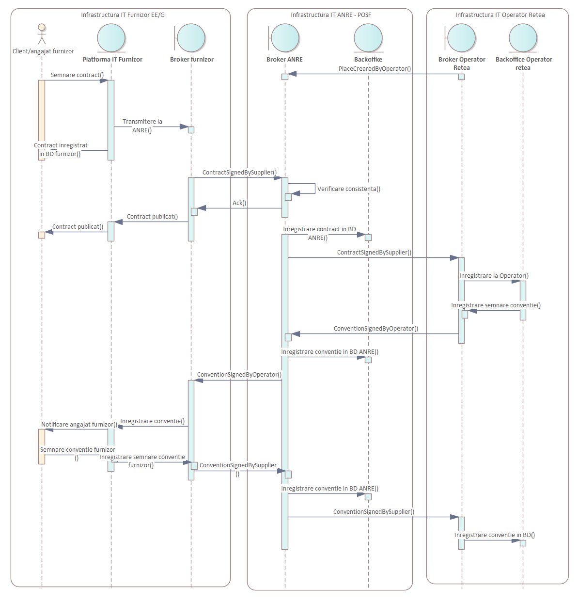

# Propunere de lucru pentru specificatia tehnica de interconectare a sistemului POSF cu furnizorii si operatorii

Documentatia generata in format HTML poate fi accesata ./doc/ANRESchema.html

Schema de ansamblu prezentata in cadrul sedintei tehnice o regasim mai jos.



.


In fisierul [ANRESchema.xsd](ANRESchema.xsd) este definitia schemei entitatilor si mesajelor propuse, primul mesaj care are o schema aproape completa este ilustrat in imagidea nde mai jos.
```
PlaceCreatedByOperator
```


# Tipuri de cozi de mesaje in POSF

Pentru fiecare actor care interactioneaza cu API POSF se vor crea 2 cozi de mesaje prin care se va comunica, cozi de mesaje gestionate in tehnologia Kafka.


- POSF.Operator1.IN - este o coada de mesaje unde scrie Operator1 iar POSF  citeste
- POSF.Operator1.OUT - este o coada de mesaje unde scrie POSF iar Operator1 citeste

Unde Operator1 este codul individualizat al fiecarui actor de tip furnizor sau operator.

Cozile de mesaje sunt accesate folosind un API de interogare (post/pool) pentru care exista un sample care poate fi instalat local [aici SAMPLE API](samples/python/). Metoda push va scrie in coada .IN iar metoda pool va citi din coada .OUT. Recomandam instalarea locala a sample-ului si exersarea metodelor pentru a transmite feedback cu privire la necesitatile tehnologice identificare.

Sistemul POSF va fi responsabil cu rutarea mesajelor intre cozile de mesaje ale furnizorilor, operatorilor precum si interfata Web pusa la dispozitie clientilor. 

# Tipuri de mesaje, emitatori si receptori

| Denumire mesaj | Scop | Sursa | Destinatie | Redirectionat la | Observatii |
|:--|:------|:--|:--|:--| :--|
|PlaceCreatedByOperator|Instiintare POSF despre un nou loc de consum|Operatorul|POSF|Nimeni| |
|ContractSignedBySupplier|Instiintare despre contract semnat de furnizor, dupa ce a semnat clientul| Furnizor,WebPOSF | POSF | Operator, WebPOSF| |
|ContractNetworkSignedByClient|Contract de retea semnat de client|WebPOSF, Operator|POSF|WebPOSF,Furnizor| |
|ContractNetworkSignedByOperator|Contract de retea semnat de client|Operator|POSF|WebPOSF,Furnizor| |
|ContractNetworkSignedBySupplier|Contract de retea semnat de client|WebPOSF, Supplier|POSF|WebPOSF,Operator| |

# Mesajul ContractNetworkSignedBySupplier

Diagrama de mai jos prezinta fluxul pe care mesajul ContractNetworkSignedBySupplier il parcurge in interiorul sistemului POSF, de la receptie in coada POSF.Supplier.IN pana cand este transmis in cozile de mesaje ale aplicatiei Web si ale operatorului respectiv.

