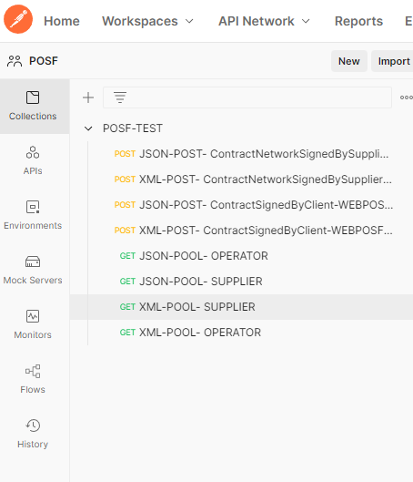
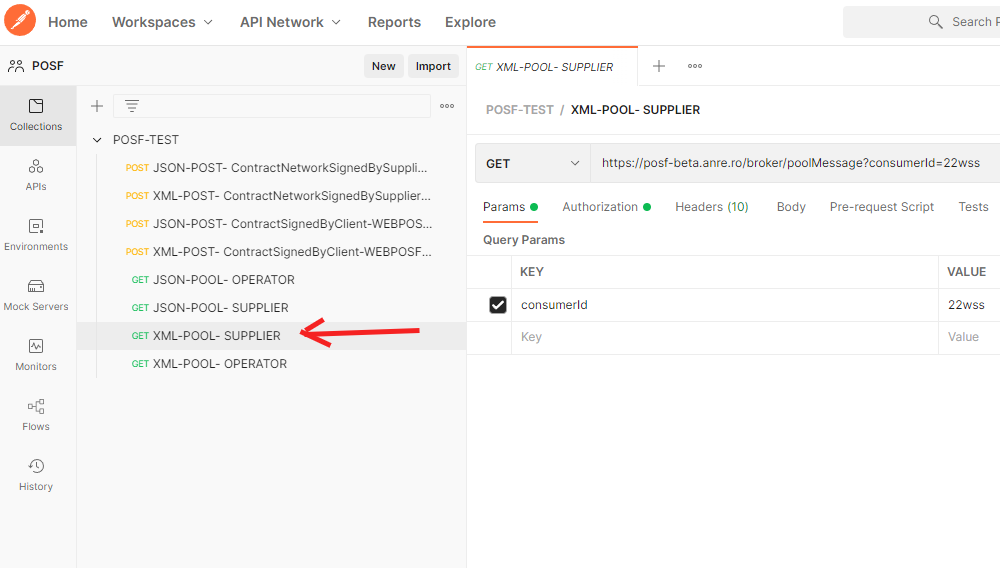
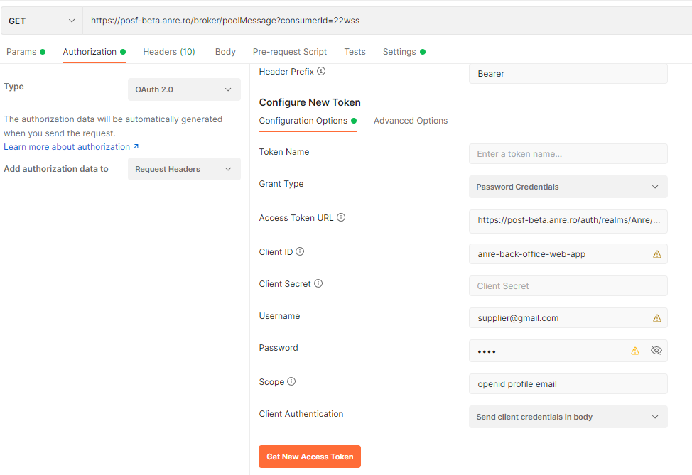
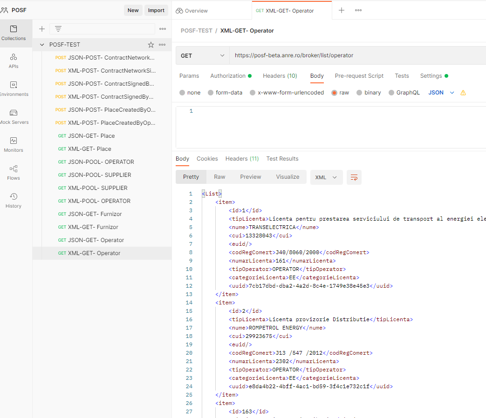

# Instructiuni de folosire a mediului de test

Pentru a pune la dispozitia furnizorilor si operatorilor a unei modalitati de verificare a implementarii standardului POSF, am configurat la adresa https://posf-beta.anre.ro/broker un API de acces la un sistem de test. Testarea interconectarii cu acest API este un bun punct de plecare pentru orice echipa care doreste adaptarea unui sistem IT existent in vederea integrarii cu platforma POSF. 

Am deschis o conversatie unde va rugam sa ne transmiteti problemele de acces identificate: [conversatie Mediul de test](https://github.com/posfgit/standard/issues/18)

## Scurta prezentare a mediului de test

Mediul de test este compus din urmatoarele subsisteme:
- subsistem de management al identitatii Keycloak https://posf-beta.anre.ro/auth/
- subsistem de gestiune a cozilor de mesaje si baza de date interna (accesibile doar prin API)
- API REST pentru publicarea si citirea de mesaje precum si alte tipuri de interogari ale sistemului https://posf-beta.anre.ro/broker/swagger-ui/index.html#/

Pentru a putea interactiona cu API in vederea publicarii si citirii de mesaje am configurat 2 utilizatori:
1. Operator cu username operator@gmail.com, parola 123 si GUID unic 5b5b51b0-bfdf-11ec-9d64-0242ac120002
2. Supplier cu username supplier@gmail.com, parola 123 si GUID unic 800903d6-bfdf-11ec-9d64-0242ac120002
3. WebPOSF fara username/parola cu GUID unic a3d9414a-bfdf-11ec-9d64-0242ac120002

## Exemplu de folosire a mediului de test

Am pregatit un mediu [POSTMAN](./samples/POSF-TEST.postman_collection.json) pe care il puteti descarca si testa cu simulatorul de API http://www.postman.com
Mediul de lucru permite apeluri cu date in format XML dar si JSON, in functie de cum preferati modificand parametruu Content-type si Accept pe header-ul requestului GET sau POST. Veti regasi exemple pentru ambele variante in Postman.

### Citirea de mesaje folosind poolMessage:

1. Descarcati mediul de test postman si importati-l in www.postman.com



Asigurati-va ca ati facut disable la verificarea certificatelor pentru request si din setarile generale Postman.

2. Deschideti din colectia POSF-TEST requestul XML-POOL-SUPPLIER



3. Initiati procesul de autorizare in tab-ul Authorization apasand butonul "Get new access token". Urmariti configurarile tokenului in partea de sus.



4. Folositi acesto token si salvati-il in tag-ul Bearer.

5. Din acest moment puteti folosi XML-POOL-SUPPLIER ca si request catre api-ul https://posf-beta.anre.ro/broker/poolMessage care la fiecare interogare va extrage date din coada de mesaje a furnizorului supplier@gmail.com unul cate unul. 
- coada de mesaje este interogata folosind un parametru numit ```consumerId```, parametru care poate fi folosit pentru a parcurge mesajele de la inceput. Avand in vedere userii si cozile din acest mediu de test vor fi folositi de mai multe persoane simultan va recomandam sa initializati acest parametru cu o valoare unica. Acest parametru poate fi folosit si in sistemul dvs de preluare a datelor daca doriti sa incepeti preluarea de la zero a informatiilor din coada in vederea recitirii acestora.
- asadar un exemplu de apel la API rest de extragere mesaje din coada se face folosind adresa https://posf-beta.anre.ro/broker/poolMessage?consumerId=2x3f4w3t6y7h3d unde 2x3f4w3t6y7h3d este un numar unic al dvs. ca si identificator de consumator de mesaje.

6. Pentru a folosi celelalte requesturi e nevoie sa parcurgeti din nou pasii 1-4 pentru a va autoriza prin obtinerea unui token.

### Publicarea de mesaje folosind postMessage

1. Selectati cererea XML-POST-ContractSignedByClient, aceasta cerere simuleaza trimiterea unui contract semnat in sistemul POSF de catre aplicatia WebPOSF, catre furnizorul supplier@gmail.com cu ID-ul 800903d6-bfdf-11ec-9d64-0242ac120002. 

2. Observati in BODY-ul requestului cum sunt populate campurile ```authorId``` cu ID-ul unic al aplicatiei WebPOSF precum si campurile ```messageID``` sau ```timestamp```. Restul de campuri au caracter de exemplu

3. Transmiteti cererea prin butonul SEND din coltul dreapta sus, veti obtine ca raspuns un identificator unic de tip reciposa a mesajului transmis.

4. Puteti verifica aparitia acestui mesaj in coada furnizorului utilizand request-ul XML-POOL-SUPPLIER


## Interogarea locurilor de consum folosind /broker/place/#

Pentru a obtine informatii privind un loc de consum se foloseste metoda /broker/place folosind operatia HTTP GET cu  parametru adresa URL a locului de consum. 

Spre exemplu daca avem locul de consum cu numarul ```612-229-1785``` aflat in localitatea ```Alba Iulia``` care are codul SIRUTA ```1017``` in judetul ```Alba```, loc de consum care este de tip ```CLC``` atunci vom folosi metoda ```/broker/place/AB/1017/CLC/612-229-1785``` pentru a solicita date de la sistem despre acest loc de consum. 

API-ul va returna o structura de tip ```Place``` daca este gasit un loc de consum care are acel cod in localitatea respectiva sau HTTP 204 daca nu exista. 

Pentru exemplul nostru sistemul va returna HTTP 200 cu urmatorul continut:

```
<Place>
    <address>
        <city>
            <code>1017</code>
            <name>Alba Iulia</name>
        </city>
        <county>AB</county>
        <extended>string</extended>
        <number>23</number>
        <position>
            <geohash>string</geohash>
            <latitude>string</latitude>
            <longitude>string</longitude>
        </position>
        <postcode>510199</postcode>
        <street>Bd. Republicii</street>
    </address>
    <code>612-229-1785</code>
    <technicalData>
        <counterIndexReadDate>2022-04-26</counterIndexReadDate>
        <counterIndexValue>002</counterIndexValue>
        <counterSeries>1122332212234</counterSeries>
        <counterType>ACTIVE</counterType>
        <date>2022-04-26</date>
        <documentType>ACORDACCES</documentType>
        <number>123</number>
        <smartMeter>true</smartMeter>
        <status>CONECTAT</status>
    </technicalData>
    <type>CLC</type>
</Place>
```

Sistemul intoarce structura Place in ultima varianta transmisa prin mesaje de tipul PlaceCreatedByOperator, PlaceUpdatedByOperator, PlaceDisconnectedByOperator. 

Pentru a testa API-ul de pe mediul de test va recomandam sa folositi cererile din POSTMAN numite XML-POST-PlaceCreatedByOperator si XML-GET-Place in aceasta ordine, pentru fiecare din acestea urmand pasii de la 1-4 pentru obtinerea tokenului de autentificare.

Incurajam operatorii sa inceapa sa posteze in mediul de test locurile de consum existente in bazele lor de date pentru a verifica functionarea corecta a interfetelor API.

## Interogarea listei furnizorilor si operatorilor folosind /broker/list/#

Pentru a obtine informatii privind lista de furnizori si operatori se foloseste metoda /broker/list/operator si /broker/list/supplier folosind operatia HTTP GET. Regasiti in Postman exemplu pentru a extrage furnizorii si operatorii in format XML sau JSON



# Considerente tehnice

- Mediul de test intoarce raspuns instantaneu la metoda postMessage fara intarzierea apelantului. 
- Mediul de test intoarce raspuns instantaneu la metoda poolMessage daca exista mesaje in coada, si raspuns HTTP 204 daca nu exista dupa un timeout de 1 secunda. 

Daca doriti alti parametri de functionare va rungam sa ne ridicati issues pe aceasta tema

# Concluzii

Mediul test disponibil simuleaza mediul real prin care orice operator/furnizor sau chiar aplicatia WebPOSF va transmite mesajele din standardul POSF in sistemul integrat. Sunt furnizate mecanismele de acces la cozile de mesaje individuale cu optiunea de a reciti toate mesajele de la inceput daca se doreste acest lucru.

Daca doriti sa vi se creeze useri dedicati de test pentru organizatia dvs. va rugam sa ne transmiteti acest lucru prin reply la conversatia deschisa aici [Mediul de test](https://github.com/posfgit/standard/issues/18). 

