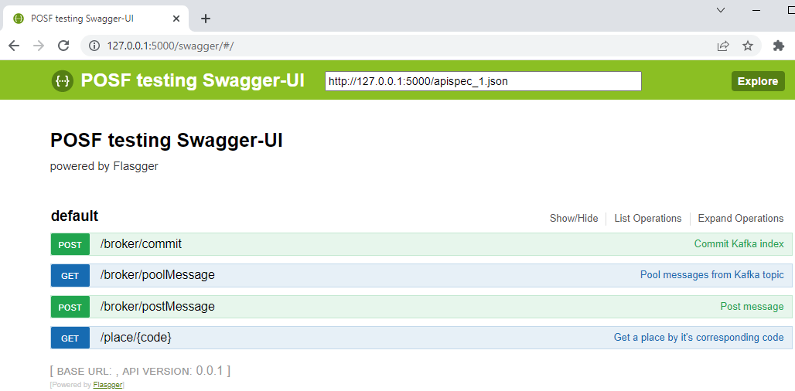

# Instalare mediu de test 



1. Se va instala o instanta de server Kafka si Zookeeper folosind docker. Adresa IP 192.168.88.180 se modifica cu adresa IP a masinii curente.

```
docker run --name zookeeper -p 2181:2181 zookeeper

docker run --name kafka -p 9092:9092 -e KAFKA_ZOOKEEPER_CONNECT=192.168.88.180:2181 -e KAFKA_ADVERTISED_LISTENERS=PLAINTEXT://192.168.88.180:9092 -e KAFKA_OFFSETS_TOPIC_REPLICATION_FACTOR=1 confluentinc/cp-kafka

```

2. Se verifica functionarea celor doua containere

```
docker container top kafka
docker container top zookeeper
```

3. Se instaleaza uneltele pentru serverul API scris in Python 3

```
pip install confluent-kafka
pip install Flask
pip install flasgger

python --version
```

4. Se modifica in fisierul demoPython.py adresa IP 192.168.88.180 in adresa IP a masinii locale.

5. Se porneste serverul demoPython.py

```
python demoPython.py
```

6. Cu ajutorul unui software care permite vizualizarea Topics in Kafka, cum ar fi [OffsetExplorer](https://www.kafkatool.com/), se verifica in serverul de Kafkanou  creat existenta a 4 Topics denumite "POSF.Supplier1.IN", "POSF.Supplier1.OUT", "POSF.Operator1.IN", "POSF.Operator1.OUT" 

7. Se foloseste interfata disponibila la adresa http://localhost:5000/swagger/ pentru a testa API expuse de sistem.

- /place/{code} - accepte orice String ca parametru
- /broker/postMessage - se testeaza cu mesajul [PlaceCreatedByOperator](../../PlaceCreatedByOperator.xml) dar si cu orice alt String/JSON
- /broker/poolMessage - doar dupa ce a fost postat un mesaj

8. Cateva exemple folosind CURL:

/place/
```
curl -X GET --header 'Accept: text/html' 'http://127.0.0.1:5000/place/1264344533'
```

/broker/postMessage
```
curl -X POST --header 'Content-Type: application/xml' --header 'Accept: text/html' -d '<?xml version="1.0" encoding="UTF-8"?> \ 
 <&#33;--Sample XML file generated by XMLSpy v2022 (x64) (http://www.altova.com)--> \ 
 <anre:PlaceCreatedByOperator xmlns:anre="http://www.anre.ro/ANRESchema" xmlns:xsi="http://www.w3.org/2001/XMLSchema-instance" xsi:schemaLocation="http://www.anre.ro/ANRESchema ANRESchema.xsd"> \ 
 	<authorID>aaaaaaaaaaaaaaaaaaaaaaaaaaaaaaaa</authorID> \ 
 	<authorName>String</authorName> \ 
 	<messageID>aaaaaaaaaaaaaaaaaaaaaaaaaaaaaaaa</messageID> \ 
 	<timestamp>2001-12-17T09:30:47Z</timestamp> \ 
 	<operator> \ 
 		<address> \ 
 			<city> \ 
 				<code>String</code> \ 
 				<name>String</name> \ 
 			</city> \ 
 			<county>CJ</county> \ 
 			<extended>String</extended> \ 
 			<number>String</number> \ 
 			<street>String</street> \ 
 		</address> \ 
 		<legalID/> \ 
 	</operator> \ 
 	<place> \ 
 		<address> \ 
 			<city> \ 
 				<code>String</code> \ 
 				<name>String</name> \ 
 			</city> \ 
 			<county>GR</county> \ 
 			<extended>String</extended> \ 
 			<number>String</number> \ 
 			<street>String</street> \ 
 		</address> \ 
 		<code>String</code> \ 
 		<technicalData> \ 
 			<counterSeries>String</counterSeries> \ 
 			<counterType>GAS</counterType> \ 
 			<date>1957-08-13</date> \ 
 			<number>String</number> \ 
 			<smartMeter>true</smartMeter> \ 
 			<status>CONECTAT</status> \ 
 		</technicalData> \ 
 		<type>CLC</type> \ 
 	</place> \ 
 </anre:PlaceCreatedByOperator> \ 
 ' 'http://127.0.0.1:5000/broker/postMessage'
```

/broker/poolMessage
```
curl -X GET --header 'Accept: application/xml' 'http://127.0.0.1:5000/broker/poolMessage'
```

